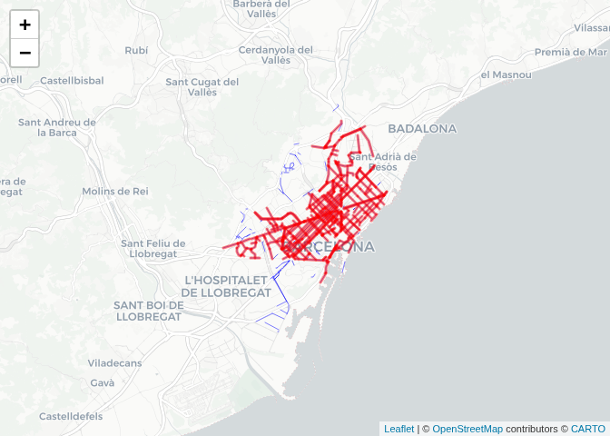
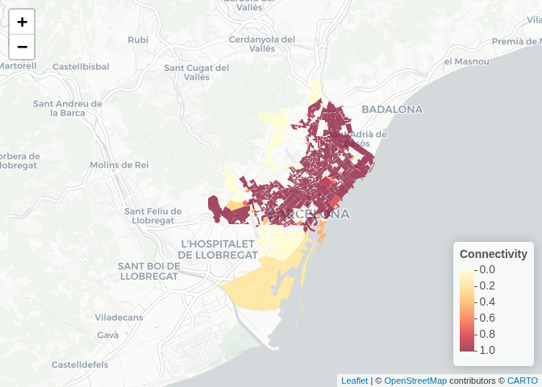
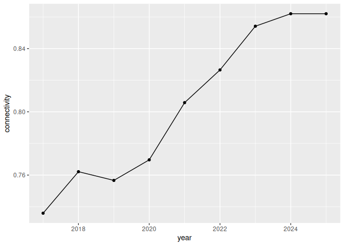

# Barcelona Cycling Network Connectivity (LCC)


This document shows how to calculate a **cycling network connectivity
indicator** for Barcelona using the **Largest Connected Component
(LCC)** of the cycling infrastructure network.

The indicator measures the **share of cycling infrastructure length that
belongs to the main connected component** of the network.

# Indicator

Connectivity is defined as:

$$
\text{Connectivity} = \frac{\text{Length of cycling network in the largest connected component}}{\text{Total cycling network length}}
$$

Values closer to **1** indicate a more connected network.

In this document, we first show the method for **one year (2025)**, then
calculate the indicator for **census tracts**, and finally repeat the
same steps for **all years**, so that we can see the trend.

# Data

Cycling infrastructure data are obtained from [**Open Data
BCN**](https://opendata-ajuntament.barcelona.cat/data/es/dataset/carril-bici),
which provides shapefiles by semester.

For consistency, we use the fourth-quarter (T4) dataset for each year
from **2017 to 2025**.

Census tract boundaries are obtained from the geopackage
`Revisió_connectivitat.gpkg`.

# 1. Load packages and data

``` r
library(sf)
library(igraph)
library(dplyr)
library(leaflet)
library(ggplot2)

segments <- st_read(
  "data/2025_4T_CARRIL_BICI/2025_4T_CARRIL_BICI.shp",
  quiet = TRUE
)

tracts <- st_read(
  "data/Revisió_connectivitat.gpkg",
  layer = "Seccions_censals",
  quiet = TRUE
)
```

# 2. Prepare the cycling network for 2025

We first transform the cycling network to a projected CRS so that
distances and lengths are measured in metres.

``` r
segments <- segments |>
  st_transform(25831) |>
  st_cast("LINESTRING")
```

# 3. Identify the largest connected component

To identify connected parts of the network, we create a small buffer
around each segment and check which segments touch each other.

``` r
buffer_dist <- 5

buf <- st_buffer(segments, buffer_dist)

touch <- st_intersects(buf)

g <- graph_from_adj_list(touch, mode = "all")

segments$component <- components(g)$membership
segments$len <- as.numeric(st_length(segments))
```

Now we identify which component has the greatest total length.

``` r
lcc_id <- segments |>
  st_drop_geometry() |>
  summarise(len = sum(len), .by = component) |>
  slice_max(len, n = 1) |>
  pull(component)

segments$LCC <- segments$component == lcc_id
```

# 4. Calculate city-level connectivity for 2025

``` r
connectivity <- sum(segments$len[segments$LCC]) / sum(segments$len)

connectivity
```

    [1] 0.8620543

# 5. Visualise the main connected component

In the map below: - **blue** shows all cycling segments - **red** shows
the segments that belong to the largest connected component

``` r
segments_ll <- st_transform(segments, 4326)

leaflet() |>
  addProviderTiles(providers$CartoDB.Positron) |>
  addPolylines(data = segments_ll, color = "blue", weight = 1) |>
  addPolylines(data = segments_ll[segments_ll$LCC, ], color = "red", weight = 3)
```

    PhantomJS not found. You can install it with webshot::install_phantomjs(). If it is installed, please make sure the phantomjs executable can be found via the PATH variable.



# 6. Calculate connectivity by census tract for 2025

Now we calculate, for each census tract, the share of cycling
infrastructure length that belongs to the city’s largest connected
component.

``` r
tracts_m <- tracts |>
  st_transform(25831) |>
  select(MUNDISSEC)

segments_tract <- st_intersection(segments, tracts_m)
```

    Warning: attribute variables are assumed to be spatially constant throughout
    all geometries

``` r
segments_tract$len <- as.numeric(st_length(segments_tract))

connectivity_tract <- segments_tract |>
  st_drop_geometry() |>
  summarise(
    total_len = sum(len),
    lcc_len = sum(len[LCC]),
    .by = MUNDISSEC
  ) |>
  mutate(
    connectivity = lcc_len / total_len
  )

connectivity_tract
```

          MUNDISSEC    total_len      lcc_len connectivity
    1   08019301001 1236.8850464 1236.8850464   1.00000000
    2   08019301003  229.2104614  229.2104614   1.00000000
    3   08019301004  302.6115976  181.7774819   0.60069569
    4   08019301007  304.1449452    0.0000000   0.00000000
    5   08019301008  108.3162881    0.0000000   0.00000000
    6   08019301010   87.6891776    0.0000000   0.00000000
    7   08019301020  223.3058284    0.0000000   0.00000000
    8   08019301021   70.3245762    0.0000000   0.00000000
    9   08019301026   58.2766999   58.2766999   1.00000000
    10  08019301030 2218.1504939 2218.1504939   1.00000000
    11  08019301031   24.9785720   24.9785720   1.00000000
    12  08019301032 1404.4041576  648.9592240   0.46208865
    13  08019301035   63.0818672   63.0818672   1.00000000
    14  08019301036 1013.4283553 1013.4283553   1.00000000
    15  08019301043 2442.9884547 2442.9884547   1.00000000
    16  08019301049   96.3484776   96.3484776   1.00000000
    17  08019301050   87.5734632   87.5734632   1.00000000
    18  08019301051    0.3029763    0.3029763   1.00000000
    19  08019301052  387.1375222  387.1375222   1.00000000
    20  08019301055 1199.7187936 1199.7187936   1.00000000
    21  08019302001  918.9715601  870.4756160   0.94722803
    22  08019302002  232.0175192  222.3063208   0.95814455
    23  08019302003  476.3864855  476.3864855   1.00000000
    24  08019302004   29.5137415   29.5137415   1.00000000
    25  08019302005  184.6325903  184.6325903   1.00000000
    26  08019302006  391.0142321  391.0142321   1.00000000
    27  08019302007  233.9559993  233.9559993   1.00000000
    28  08019302008  417.8851834  417.8851834   1.00000000
    29  08019302009  745.3888881  745.3888881   1.00000000
    30  08019302010  312.0526832  312.0526832   1.00000000
    31  08019302011  285.8650277  285.8650277   1.00000000
    32  08019302012  602.8259776  602.8259776   1.00000000
    33  08019302013 1572.2672062 1572.2672062   1.00000000
    34  08019302014  314.7303572  314.7303572   1.00000000
    35  08019302015  252.3766928  252.3766928   1.00000000
    36  08019302016  895.0709615  895.0709615   1.00000000
    37  08019302017  889.1136399  889.1136399   1.00000000
    38  08019302018  268.4955231  268.4955231   1.00000000
    39  08019302019  617.4053692  617.4053692   1.00000000
    40  08019302020 1108.7768531 1108.7768531   1.00000000
    41  08019302021  555.5383307  555.5383307   1.00000000
    42  08019302022  570.2125128  570.2125128   1.00000000
    43  08019302023  555.5610169  555.5610169   1.00000000
    44  08019302024 1072.7868319 1072.7868319   1.00000000
    45  08019302026  256.8656184  256.8656184   1.00000000
    46  08019302027  259.2549670  259.2549670   1.00000000
    47  08019302028  791.7072531  791.7072531   1.00000000
    48  08019302029  267.0750652  267.0750652   1.00000000
    49  08019302031  268.7158025  268.7158025   1.00000000
    50  08019302032  548.0708269  548.0708269   1.00000000
    51  08019302033  275.2435669  275.2435669   1.00000000
    52  08019302037  518.9777689  518.9777689   1.00000000
    53  08019302038  268.2579002  268.2579002   1.00000000
    54  08019302039  267.5727514  267.5727514   1.00000000
    55  08019302040  537.4276431  537.4276431   1.00000000
    56  08019302041  284.4362033  284.4362033   1.00000000
    57  08019302042  253.5752867  253.5752867   1.00000000
    58  08019302043  430.8361125  430.8361125   1.00000000
    59  08019302044  264.6719501  264.6719501   1.00000000
    60  08019302048  273.2181812  273.2181812   1.00000000
    61  08019302049  650.7468786  650.7468786   1.00000000
    62  08019302050  261.3701113  261.3701113   1.00000000
    63  08019302051  727.6519749  727.6519749   1.00000000
    64  08019302052  515.2805410  515.2805410   1.00000000
    65  08019302053 1185.9918487 1185.9918487   1.00000000
    66  08019302054  133.6091969  133.6091969   1.00000000
    67  08019302055  133.4226426  133.4226426   1.00000000
    68  08019302056 1107.0772286 1107.0772286   1.00000000
    69  08019302057  557.4226742  557.4226742   1.00000000
    70  08019302058  153.7487838  153.7487838   1.00000000
    71  08019302059  184.9869338  184.9869338   1.00000000
    72  08019302060  748.2973913  748.2973913   1.00000000
    73  08019302061  440.1693622  440.1693622   1.00000000
    74  08019302062  742.2773024  742.2773024   1.00000000
    75  08019302063  497.3719810  497.3719810   1.00000000
    76  08019302064  534.5095941  534.5095941   1.00000000
    77  08019302065   53.1179043   53.1179043   1.00000000
    78  08019302066  307.2839505  307.2839505   1.00000000
    79  08019302067  652.3326851  652.3326851   1.00000000
    80  08019302068  444.0875429  444.0875429   1.00000000
    81  08019302069  656.1665348  656.1665348   1.00000000
    82  08019302070  401.0496680  401.0496680   1.00000000
    83  08019302071  401.1976742  401.1976742   1.00000000
    84  08019302072  440.9620906  440.9620906   1.00000000
    85  08019302073  243.2048563  243.2048563   1.00000000
    86  08019302074  328.5132230  328.5132230   1.00000000
    87  08019302075  500.3222042  500.3222042   1.00000000
    88  08019302076  550.1583125  550.1583125   1.00000000
    89  08019302077 1782.0414842 1782.0414842   1.00000000
    90  08019302078 1818.7316230 1818.7316230   1.00000000
    91  08019302079 1057.4331959 1057.4331959   1.00000000
    92  08019302080 1706.9426278 1706.9426278   1.00000000
    93  08019302081 1098.8640958 1098.8640958   1.00000000
    94  08019302082  792.2034618  792.2034618   1.00000000
    95  08019302083  479.2840246  479.2840246   1.00000000
    96  08019302084  267.6499198  267.6499198   1.00000000
    97  08019302085  757.3011010  757.3011010   1.00000000
    98  08019302086  420.3460375  420.3460375   1.00000000
    99  08019302088  939.6576353  939.6576353   1.00000000
    100 08019302089  535.4123180  535.4123180   1.00000000
    101 08019302090  212.6156757  212.6156757   1.00000000
    102 08019302091 1069.9167268 1069.9167268   1.00000000
    103 08019302092  420.8004495  420.8004495   1.00000000
    104 08019302093  275.2877978  275.2877978   1.00000000
    105 08019302094  268.2952374  268.2952374   1.00000000
    106 08019302095  268.4935896  268.4935896   1.00000000
    107 08019302096  287.0367648  287.0367648   1.00000000
    108 08019302097  134.3536313  134.3536313   1.00000000
    109 08019302098  180.2636322  180.2636322   1.00000000
    110 08019302099  362.1106295  362.1106295   1.00000000
    111 08019302100  390.1433494  390.1433494   1.00000000
    112 08019302101  534.8149750  534.8149750   1.00000000
    113 08019302104   34.9657420   34.9657420   1.00000000
    114 08019302106  415.6316696  415.6316696   1.00000000
    115 08019302107  419.4599298  419.4599298   1.00000000
    116 08019302108  829.0493097  829.0493097   1.00000000
    117 08019302109  389.5544160  389.5544160   1.00000000
    118 08019302110  895.0007100  895.0007100   1.00000000
    119 08019302111  526.1959796  526.1959796   1.00000000
    120 08019302112  686.5864694  686.5864694   1.00000000
    121 08019302113  133.9195004  133.9195004   1.00000000
    122 08019302114  134.6927469  134.6927469   1.00000000
    123 08019302117  143.8442746  143.8442746   1.00000000
    124 08019302118  657.8753751  644.9609764   0.98036954
    125 08019302119  134.1381650  134.1381650   1.00000000
    126 08019302120  134.1761590  134.1761590   1.00000000
    127 08019302121  551.5019715  399.0316199   0.72353616
    128 08019302122  268.5869167  268.5869167   1.00000000
    129 08019302123  133.4198668  133.4198668   1.00000000
    130 08019302125  133.8394829  133.8394829   1.00000000
    131 08019302126  196.3484603  196.3484603   1.00000000
    132 08019302127  221.7401931  221.7401931   1.00000000
    133 08019302128  270.9981799  270.9981799   1.00000000
    134 08019302129  787.6751690  787.6751690   1.00000000
    135 08019302130  141.8942983  141.8942983   1.00000000
    136 08019302131   51.6820269   51.6820269   1.00000000
    137 08019302133  131.8482791  131.8482791   1.00000000
    138 08019302134  312.0176391  312.0176391   1.00000000
    139 08019302135  140.5468732  140.5468732   1.00000000
    140 08019302136  134.1049158  134.1049158   1.00000000
    141 08019302137  320.8597890  320.8597890   1.00000000
    142 08019302138  241.6952376  241.6952376   1.00000000
    143 08019302139  478.5283072  478.5283072   1.00000000
    144 08019302140  268.0034868  268.0034868   1.00000000
    145 08019302141  266.7143326  266.7143326   1.00000000
    146 08019302142  401.6054775  401.6054775   1.00000000
    147 08019302143  400.1249891  400.1249891   1.00000000
    148 08019302144  414.4597121  414.4597121   1.00000000
    149 08019302145  415.4770161  415.4770161   1.00000000
    150 08019302146  133.8059652  133.8059652   1.00000000
    151 08019302147  267.3639234  267.3639234   1.00000000
    152 08019302148  999.5848818  999.5848818   1.00000000
    153 08019302149  816.8262512  816.8262512   1.00000000
    154 08019302150  377.9257788  377.9257788   1.00000000
    155 08019302151  333.6483933  333.6483933   1.00000000
    156 08019302152  134.1755392  134.1755392   1.00000000
    157 08019302154  325.8863622  325.8863622   1.00000000
    158 08019302155  190.0461745  190.0461745   1.00000000
    159 08019302156  134.5336326  134.5336326   1.00000000
    160 08019302157  133.6550304  133.6550304   1.00000000
    161 08019302158  133.5024107  133.5024107   1.00000000
    162 08019302159  415.9307078  415.9307078   1.00000000
    163 08019302160  421.6642370  421.6642370   1.00000000
    164 08019302162  140.9004738  140.9004738   1.00000000
    165 08019302163  269.1082821  269.1082821   1.00000000
    166 08019302164  534.9319161  534.9319161   1.00000000
    167 08019302166  135.2119613  135.2119613   1.00000000
    168 08019302168  130.4385790  130.4385790   1.00000000
    169 08019302169  406.1452709  406.1452709   1.00000000
    170 08019302170  482.7402108  482.7402108   1.00000000
    171 08019302171  379.2114057  379.2114057   1.00000000
    172 08019302172  139.5072782  133.9090261   0.95987125
    173 08019302173  694.0844750  584.9022686   0.84269608
    174 08019303001    0.9033349    0.9033349   1.00000000
    175 08019303003    8.9510018    8.9510018   1.00000000
    176 08019303020  170.1219856  170.1219856   1.00000000
    177 08019303024  816.5111081    0.0000000   0.00000000
    178 08019303025 7570.5438114 1511.1920272   0.19961473
    179 08019303028  608.6725667    0.0000000   0.00000000
    180 08019303030  534.1515118    0.0000000   0.00000000
    181 08019303031  257.0730635    0.0000000   0.00000000
    182 08019303032  268.2879545    0.0000000   0.00000000
    183 08019303034  132.2596097    0.0000000   0.00000000
    184 08019303035  103.8720764    0.0000000   0.00000000
    185 08019303036 1075.6750517    0.0000000   0.00000000
    186 08019303039   86.5491047    0.0000000   0.00000000
    187 08019303040  388.3721964    0.0000000   0.00000000
    188 08019303041   96.3223014    0.0000000   0.00000000
    189 08019303043  182.1600827    0.0000000   0.00000000
    190 08019303044  225.7309667    0.0000000   0.00000000
    191 08019303046  140.0884038    0.0000000   0.00000000
    192 08019303047  544.1931365  544.1931365   1.00000000
    193 08019303048  539.7401090  539.7401090   1.00000000
    194 08019303051   52.1856753    0.0000000   0.00000000
    195 08019303052   91.1000658    0.0000000   0.00000000
    196 08019303053   21.0474911    0.0000000   0.00000000
    197 08019303054  646.4606846    0.0000000   0.00000000
    198 08019303055  119.6360480    0.0000000   0.00000000
    199 08019303056  110.4323832    0.0000000   0.00000000
    200 08019303057  120.6504869    0.0000000   0.00000000
    201 08019303058  403.9088997    0.0000000   0.00000000
    202 08019303060  146.6692037    0.0000000   0.00000000
    203 08019303061   38.8892594    0.0000000   0.00000000
    204 08019303062   39.9212111    0.0000000   0.00000000
    205 08019303063  241.2977669    0.0000000   0.00000000
    206 08019303064  516.0447788    0.0000000   0.00000000
    207 08019303081  215.5877916  215.5877916   1.00000000
    208 08019303088  191.6224716  191.6224716   1.00000000
    209 08019303089  201.4343083  201.4343083   1.00000000
    210 08019303090  247.7346176  247.7346176   1.00000000
    211 08019303096    6.7980875    6.7980875   1.00000000
    212 08019303100   11.5148807    0.0000000   0.00000000
    213 08019303105   70.6101285    0.0000000   0.00000000
    214 08019303106  196.5482801   76.2743239   0.38806915
    215 08019303107   93.4710937   93.4710937   1.00000000
    216 08019303108  211.7254770    0.0000000   0.00000000
    217 08019303113  579.0803575  579.0803575   1.00000000
    218 08019303114  352.1765565  352.1765565   1.00000000
    219 08019303211  144.7818827    0.0000000   0.00000000
    220 08019303212  442.2711360    0.0000000   0.00000000
    221 08019303213  106.2971044    0.0000000   0.00000000
    222 08019304001  292.7736017  292.7736017   1.00000000
    223 08019304002  383.4404999  383.4404999   1.00000000
    224 08019304003  123.0753072  123.0753072   1.00000000
    225 08019304009  330.4782433  330.4782433   1.00000000
    226 08019304012  281.6195243  281.6195243   1.00000000
    227 08019304015  156.2196760  156.2196760   1.00000000
    228 08019304016  195.7595841  195.7595841   1.00000000
    229 08019304017  394.6023798  394.6023798   1.00000000
    230 08019304018  334.2979455  334.2979455   1.00000000
    231 08019304019  340.3821036  266.2762694   0.78228634
    232 08019304022  342.8562648  342.8562648   1.00000000
    233 08019304023  891.2788136  891.2788136   1.00000000
    234 08019304024  539.4353813  539.4353813   1.00000000
    235 08019304028  399.5365019  399.5365019   1.00000000
    236 08019304029  161.1681336   21.6856884   0.13455320
    237 08019304030  280.3550507  125.5428249   0.44779941
    238 08019304031  248.4252419  248.4252419   1.00000000
    239 08019304032  233.8184936  233.8184936   1.00000000
    240 08019304033    8.9179799    8.9179799   1.00000000
    241 08019304034  328.8731202    0.0000000   0.00000000
    242 08019304041  158.0922455  158.0922455   1.00000000
    243 08019304042  167.8273113  167.8273113   1.00000000
    244 08019304043  272.6928630  272.6928630   1.00000000
    245 08019304046  434.3100120  434.3100120   1.00000000
    246 08019304047 1521.9647915 1521.9647915   1.00000000
    247 08019304049 2329.0133152 2306.7780309   0.99045292
    248 08019304050  143.7397794  143.7397794   1.00000000
    249 08019304052  567.5973954  390.2793837   0.68759897
    250 08019304053 3072.5271600  914.4999171   0.29763770
    251 08019304054  847.6792608  847.6792608   1.00000000
    252 08019304055  456.3679252    0.0000000   0.00000000
    253 08019305005 1211.6018934    0.0000000   0.00000000
    254 08019305006   18.6246767    0.0000000   0.00000000
    255 08019305008  432.3256374  432.3256374   1.00000000
    256 08019305011   75.9132012    0.0000000   0.00000000
    257 08019305012  734.9316358  422.0608338   0.57428584
    258 08019305021  608.2458656  608.2458656   1.00000000
    259 08019305022  144.6118888  144.6118888   1.00000000
    260 08019305024  544.5396548  544.5396548   1.00000000
    261 08019305025  528.4058540  528.4058540   1.00000000
    262 08019305026  312.1306400  312.1306400   1.00000000
    263 08019305027    5.5577147    5.5577147   1.00000000
    264 08019305028  566.6069222  566.6069222   1.00000000
    265 08019305030  143.2844760  143.2844760   1.00000000
    266 08019305049  573.5195803  573.5195803   1.00000000
    267 08019305051  219.0026329  219.0026329   1.00000000
    268 08019305052  309.5665130  309.5665130   1.00000000
    269 08019305053  713.3875252  713.3875252   1.00000000
    270 08019305054   62.0671871   62.0671871   1.00000000
    271 08019305055  352.3164677  352.3164677   1.00000000
    272 08019305056  951.7767330  951.7767330   1.00000000
    273 08019305057  489.6325390  489.6325390   1.00000000
    274 08019305058  317.2894839  317.2894839   1.00000000
    275 08019305059  656.3868787  656.3868787   1.00000000
    276 08019305060   97.4812420   97.4812420   1.00000000
    277 08019305061  203.7172577  203.7172577   1.00000000
    278 08019305062   95.6274952   95.6274952   1.00000000
    279 08019305063  220.0523629  220.0523629   1.00000000
    280 08019305065  148.5735748  148.5735748   1.00000000
    281 08019305066  150.1036488  150.1036488   1.00000000
    282 08019305067  587.2258964  587.2258964   1.00000000
    283 08019305068  644.4859697  644.4859697   1.00000000
    284 08019305071  507.8261089  507.8261089   1.00000000
    285 08019305073  197.2817805  197.2817805   1.00000000
    286 08019305074  177.1858016  177.1858016   1.00000000
    287 08019305075  380.8358947  380.8358947   1.00000000
    288 08019305076   78.8503915   78.8503915   1.00000000
    289 08019305081  321.6414000  321.6414000   1.00000000
    290 08019305082    3.6537000    3.6537000   1.00000000
    291 08019306001  101.9458964    0.0000000   0.00000000
    292 08019306002  211.1416339    0.0000000   0.00000000
    293 08019306003  104.9736499    0.0000000   0.00000000
    294 08019306004   97.6455320    0.0000000   0.00000000
    295 08019306006  672.0242492    0.0000000   0.00000000
    296 08019306007  385.0878362    0.0000000   0.00000000
    297 08019306011  249.3451187    0.0000000   0.00000000
    298 08019306012  324.8798941    0.0000000   0.00000000
    299 08019306024  162.3092348    0.0000000   0.00000000
    300 08019306025  226.2252032    0.0000000   0.00000000
    301 08019306041   69.4624922   69.4624922   1.00000000
    302 08019306042  222.2354360  222.2354360   1.00000000
    303 08019306043  111.3774752  111.3774752   1.00000000
    304 08019306044  618.5486599  618.5486599   1.00000000
    305 08019306045   62.4615804   62.4615804   1.00000000
    306 08019306057    4.7984028    4.7984028   1.00000000
    307 08019306060  118.6900724  118.6900724   1.00000000
    308 08019306063  279.6404310  279.6404310   1.00000000
    309 08019306064  421.3523326  421.3523326   1.00000000
    310 08019306065  153.5472396  153.5472396   1.00000000
    311 08019306067  402.4707890  402.4707890   1.00000000
    312 08019306068  259.9895859  259.9895859   1.00000000
    313 08019306069  134.3790296  134.3790296   1.00000000
    314 08019306071  132.5258155  132.5258155   1.00000000
    315 08019306072  135.2286591  135.2286591   1.00000000
    316 08019306074  134.3196621  134.3196621   1.00000000
    317 08019306076  394.2335991  394.2335991   1.00000000
    318 08019306077  369.6304520  369.6304520   1.00000000
    319 08019306079  190.9381256  190.9381256   1.00000000
    320 08019306080  137.6311029  137.6311029   1.00000000
    321 08019306081  315.8095770  315.8095770   1.00000000
    322 08019306082    3.3564540    3.3564540   1.00000000
    323 08019306087   53.8307100   53.8307100   1.00000000
    324 08019306088   11.4239817   11.4239817   1.00000000
    325 08019307001  455.7668266  455.7668266   1.00000000
    326 08019307002  708.6566228  708.6566228   1.00000000
    327 08019307003  186.3687699  186.3687699   1.00000000
    328 08019307005  126.2492757  126.2492757   1.00000000
    329 08019307006  201.5641315  201.5641315   1.00000000
    330 08019307010  132.7786720  132.7786720   1.00000000
    331 08019307011  241.6040808  241.6040808   1.00000000
    332 08019307014    8.4531719    8.4531719   1.00000000
    333 08019307016   95.8299432    0.0000000   0.00000000
    334 08019307017  193.1574868   18.9459565   0.09808554
    335 08019307018  232.1661717  232.1661717   1.00000000
    336 08019307019  285.6102352    0.0000000   0.00000000
    337 08019307033  183.0216825  183.0216825   1.00000000
    338 08019307034  280.9765331  280.9765331   1.00000000
    339 08019307035  313.9658528  313.9658528   1.00000000
    340 08019307036  226.5150278  226.5150278   1.00000000
    341 08019307037   96.1989130   96.1989130   1.00000000
    342 08019307038  483.0017493  483.0017493   1.00000000
    343 08019307039  394.5751620  394.5751620   1.00000000
    344 08019307040  135.1824641  135.1824641   1.00000000
    345 08019307041   56.8241336   56.8241336   1.00000000
    346 08019307042  278.8237559  278.8237559   1.00000000
    347 08019307044  145.3569099  145.3569099   1.00000000
    348 08019307045  288.5706471  288.5706471   1.00000000
    349 08019307073   26.5001010    0.0000000   0.00000000
    350 08019307088  472.3948187    0.0000000   0.00000000
    351 08019307098  410.6958645    0.0000000   0.00000000
    352 08019307100   52.4411362    0.0000000   0.00000000
    353 08019307101 1923.2416536    0.0000000   0.00000000
    354 08019307102  543.2813334    0.0000000   0.00000000
    355 08019307103  276.9176224    0.0000000   0.00000000
    356 08019307111  203.2842825    0.0000000   0.00000000
    357 08019307112  547.9556152    0.0000000   0.00000000
    358 08019307118   64.2016642    0.0000000   0.00000000
    359 08019308012  655.2557649  354.8186599   0.54149643
    360 08019308013  270.4915507    8.0007927   0.02957872
    361 08019308014  269.9215710  269.9215710   1.00000000
    362 08019308018  114.8622631  114.8622631   1.00000000
    363 08019308019  278.9925629  278.9925629   1.00000000
    364 08019308022  185.2977581  185.2977581   1.00000000
    365 08019308024  134.2908451  134.2908451   1.00000000
    366 08019308025    6.1812857    6.1812857   1.00000000
    367 08019308027  256.9227615  256.9227615   1.00000000
    368 08019308028  250.7420415  250.7420415   1.00000000
    369 08019308029  762.4783131  762.4783131   1.00000000
    370 08019308030  207.4318597  207.4318597   1.00000000
    371 08019308033   87.3886709   87.3886709   1.00000000
    372 08019308051  120.5632499  120.5632499   1.00000000
    373 08019308052   49.1973657   49.1973657   1.00000000
    374 08019308053  106.7522058  106.7522058   1.00000000
    375 08019308054  256.0360832  256.0360832   1.00000000
    376 08019308055  297.5310581  297.5310581   1.00000000
    377 08019308057  118.9319281  118.9319281   1.00000000
    378 08019308067    3.0371138    3.0371138   1.00000000
    379 08019308074  169.4451630  169.4451630   1.00000000
    380 08019308075  167.3609622  167.3609622   1.00000000
    381 08019308076  258.4998495  258.4998495   1.00000000
    382 08019308082  272.2193131  272.2193131   1.00000000
    383 08019308083  625.1310978  625.1310978   1.00000000
    384 08019308084  146.1325984  146.1325984   1.00000000
    385 08019308086  261.4291753  261.4291753   1.00000000
    386 08019308087   28.7669205   28.7669205   1.00000000
    387 08019308089  109.2917892  109.2917892   1.00000000
    388 08019308092  347.5971466  347.5971466   1.00000000
    389 08019308094  300.4523425  300.4523425   1.00000000
    390 08019308095   29.8568336   29.8568336   1.00000000
    391 08019308096   44.8672806   44.8672806   1.00000000
    392 08019308102   29.6047109   29.6047109   1.00000000
    393 08019308103  416.6004236  416.6004236   1.00000000
    394 08019308104    9.3601396    0.0000000   0.00000000
    395 08019308105  290.3289370    0.0000000   0.00000000
    396 08019308106  217.2044917    0.0000000   0.00000000
    397 08019308107  545.7930073  545.7930073   1.00000000
    398 08019308108  222.0113472    0.0000000   0.00000000
    399 08019308116  379.2536358    0.0000000   0.00000000
    400 08019309005  469.8690966  469.8690966   1.00000000
    401 08019309006  343.2513735  343.2513735   1.00000000
    402 08019309007   41.6065280   41.6065280   1.00000000
    403 08019309008  149.4806183  149.4806183   1.00000000
    404 08019309009 1236.9825212 1236.9825212   1.00000000
    405 08019309010  255.8639973  255.8639973   1.00000000
    406 08019309015  147.2766931  147.2766931   1.00000000
    407 08019309017  315.0454320  315.0454320   1.00000000
    408 08019309018  195.9611282  195.9611282   1.00000000
    409 08019309019  338.0418480  338.0418480   1.00000000
    410 08019309020  182.4753863  182.4753863   1.00000000
    411 08019309021   56.0067104   56.0067104   1.00000000
    412 08019309022   75.5967956   75.5967956   1.00000000
    413 08019309024  215.1994460  215.1994460   1.00000000
    414 08019309025   74.3599031   74.3599031   1.00000000
    415 08019309031  412.7052618  412.7052618   1.00000000
    416 08019309032 1091.6254055 1091.6254055   1.00000000
    417 08019309033  397.3824288  397.3824288   1.00000000
    418 08019309049  383.8881114  383.8881114   1.00000000
    419 08019309050    6.0639597    6.0639597   1.00000000
    420 08019309051    2.9862306    2.9862306   1.00000000
    421 08019309052  140.1271312  140.1271312   1.00000000
    422 08019309053  161.0543839  161.0543839   1.00000000
    423 08019309054  232.0539437  232.0539437   1.00000000
    424 08019309055  380.6815052  380.6815052   1.00000000
    425 08019309056   76.7479186   76.7479186   1.00000000
    426 08019309057  378.6754445  378.6754445   1.00000000
    427 08019309058  226.0402321  226.0402321   1.00000000
    428 08019309060   21.3767766   21.3767766   1.00000000
    429 08019309061  302.4754921  302.4754921   1.00000000
    430 08019309062  648.9619769  648.9619769   1.00000000
    431 08019309063  781.0783470  781.0783470   1.00000000
    432 08019309064  148.3769169  148.3769169   1.00000000
    433 08019309065   55.6227763   55.6227763   1.00000000
    434 08019309067  260.2518628  260.2518628   1.00000000
    435 08019309068  179.6579024  179.6579024   1.00000000
    436 08019309069  341.1142945  341.1142945   1.00000000
    437 08019309070   75.8720334   75.8720334   1.00000000
    438 08019309071  278.0445803  278.0445803   1.00000000
    439 08019309076  186.3138538  186.3138538   1.00000000
    440 08019309077  361.8114922  361.8114922   1.00000000
    441 08019309079  147.9586940  147.9586940   1.00000000
    442 08019309081  321.7604332  321.7604332   1.00000000
    443 08019309082  306.6823279  306.6823279   1.00000000
    444 08019309083  414.3603568  414.3603568   1.00000000
    445 08019309084  258.2413243  258.2413243   1.00000000
    446 08019309085  268.7093057  268.7093057   1.00000000
    447 08019309086  133.1161852  133.1161852   1.00000000
    448 08019309087  301.2898171  301.2898171   1.00000000
    449 08019309088  414.0140293  414.0140293   1.00000000
    450 08019309089  306.1391485  306.1391485   1.00000000
    451 08019309091  252.6502894  252.6502894   1.00000000
    452 08019309092  388.4869534  388.4869534   1.00000000
    453 08019309093  134.2997255  134.2997255   1.00000000
    454 08019309094  155.9969663  155.9969663   1.00000000
    455 08019309095  445.4506231  445.4506231   1.00000000
    456 08019310001  106.3040850  106.3040850   1.00000000
    457 08019310002  263.9216259  263.9216259   1.00000000
    458 08019310003   13.6104050   13.6104050   1.00000000
    459 08019310004  269.9612197  269.9612197   1.00000000
    460 08019310005  751.6256085  751.6256085   1.00000000
    461 08019310006  597.9568173  597.9568173   1.00000000
    462 08019310007  522.4522641  522.4522641   1.00000000
    463 08019310008  460.1945010  460.1945010   1.00000000
    464 08019310009  102.3224274  102.3224274   1.00000000
    465 08019310010  265.8382935  265.8382935   1.00000000
    466 08019310011  255.9298724  255.9298724   1.00000000
    467 08019310012  407.2418780  407.2418780   1.00000000
    468 08019310013  289.1171911  289.1171911   1.00000000
    469 08019310014  294.5327562  294.5327562   1.00000000
    470 08019310015  257.6633336  257.6633336   1.00000000
    471 08019310016  409.8840535  409.8840535   1.00000000
    472 08019310017  160.8399105  160.8399105   1.00000000
    473 08019310018   71.2707308   71.2707308   1.00000000
    474 08019310019  310.6123628  310.6123628   1.00000000
    475 08019310020   81.5849891   81.5849891   1.00000000
    476 08019310021   41.8664880   41.8664880   1.00000000
    477 08019310022  131.6372916  131.6372916   1.00000000
    478 08019310023  107.0252977  107.0252977   1.00000000
    479 08019310024   14.3721984   14.3721984   1.00000000
    480 08019310025  324.9651554  324.9651554   1.00000000
    481 08019310026  634.6634844  634.6634844   1.00000000
    482 08019310027  250.4158902  250.4158902   1.00000000
    483 08019310028  161.8631556  161.8631556   1.00000000
    484 08019310029  358.8113999  358.8113999   1.00000000
    485 08019310030  180.7481855  180.7481855   1.00000000
    486 08019310031  496.5948511  496.5948511   1.00000000
    487 08019310032   88.9320437   88.9320437   1.00000000
    488 08019310033  270.5069920  270.5069920   1.00000000
    489 08019310034  131.5035130  131.5035130   1.00000000
    490 08019310035  283.0789168  283.0789168   1.00000000
    491 08019310038  192.3148247  192.3148247   1.00000000
    492 08019310039  665.4161037  665.4161037   1.00000000
    493 08019310040  728.8288747  728.8288747   1.00000000
    494 08019310041  590.6276551  590.6276551   1.00000000
    495 08019310042 2183.7178414 2031.4991417   0.93029379
    496 08019310043 2866.0574589 2866.0574589   1.00000000
    497 08019310044 1096.0140733 1096.0140733   1.00000000
    498 08019310045    6.5914393    6.5914393   1.00000000
    499 08019310047  282.9358304  282.9358304   1.00000000
    500 08019310048  472.7598706  472.7598706   1.00000000
    501 08019310049  352.0544114  352.0544114   1.00000000
    502 08019310050  591.5954570  591.5954570   1.00000000
    503 08019310051  296.6581547  296.6581547   1.00000000
    504 08019310052 1080.2283294 1080.2283294   1.00000000
    505 08019310053  507.2477269  507.2477269   1.00000000
    506 08019310054 1723.7113350 1723.7113350   1.00000000
    507 08019310055 1040.1922649  802.0657114   0.77107448
    508 08019310056  586.8644986  586.8644986   1.00000000
    509 08019310057  902.3013635  902.3013635   1.00000000
    510 08019310058  259.3638729  259.3638729   1.00000000
    511 08019310059  829.4976943  829.4976943   1.00000000
    512 08019310060  100.0678077  100.0678077   1.00000000
    513 08019310061  114.1585337  114.1585337   1.00000000
    514 08019310063  208.5169134  208.5169134   1.00000000
    515 08019310064  207.1676602  207.1676602   1.00000000
    516 08019310066  185.3736611  127.6076486   0.68838069
    517 08019310067  479.9171041  278.2590947   0.57980658
    518 08019310068  458.0584567  458.0584567   1.00000000
    519 08019310069  813.5361200  813.5361200   1.00000000
    520 08019310070  424.5240872  424.5240872   1.00000000
    521 08019310071  524.5018229  524.5018229   1.00000000
    522 08019310072  442.4992446  442.4992446   1.00000000
    523 08019310073  134.2433042  134.2433042   1.00000000
    524 08019310074  212.7472368  212.7472368   1.00000000
    525 08019310075  326.3653686  326.3653686   1.00000000
    526 08019310076  867.5483384  867.5483384   1.00000000
    527 08019310077  268.3844984  268.3844984   1.00000000
    528 08019310078 1735.2621609 1735.2621609   1.00000000
    529 08019310079  596.0689515  596.0689515   1.00000000
    530 08019310080 2378.3580660 2378.3580660   1.00000000
    531 08019310081  640.2097647  640.2097647   1.00000000
    532 08019310083  241.8223593    0.0000000   0.00000000
    533 08019310085  383.0270327  139.4924351   0.36418431
    534 08019310086  122.0444315  122.0444315   1.00000000
    535 08019310087  128.6857514  128.6857514   1.00000000
    536 08019310088  167.9242363  167.9242363   1.00000000
    537 08019310089  632.8223278  632.8223278   1.00000000
    538 08019310090  257.2850609  257.2850609   1.00000000
    539 08019310091  272.4429194  272.4429194   1.00000000
    540 08019310092  916.1203700  916.1203700   1.00000000
    541 08019310093   59.7289215   59.7289215   1.00000000
    542 08019310094 2116.0836098 2116.0836098   1.00000000
    543 08019310096 1052.5568830 1052.5568830   1.00000000
    544 08019310097  167.2051117  167.2051117   1.00000000
    545 08019310099  148.6317322  148.6317322   1.00000000
    546 08019310100  691.5966366  691.5966366   1.00000000
    547 08019310101  344.4980208  344.4980208   1.00000000
    548 08019310103  287.9590744  287.9590744   1.00000000
    549 08019310107  282.5197289  282.5197289   1.00000000
    550 08019310109   62.2715575   62.2715575   1.00000000
    551 08019310110  682.4999298  682.4999298   1.00000000
    552 08019310111  202.5714223  202.5714223   1.00000000
    553 08019310112  137.5126188  137.5126188   1.00000000
    554 08019310113  345.5906876  345.5906876   1.00000000
    555 08019310114   70.7823816   70.7823816   1.00000000
    556 08019310115  271.8389996  271.8389996   1.00000000
    557 08019310116  107.8467492  107.8467492   1.00000000
    558 08019310117  134.2015202  134.2015202   1.00000000
    559 08019310118  130.5864842  130.5864842   1.00000000
    560 08019310119  128.0310647  128.0310647   1.00000000
    561 08019310120  634.0332345  634.0332345   1.00000000
    562 08019310121  246.8529232  246.8529232   1.00000000
    563 08019310122  283.5186292  283.5186292   1.00000000
    564 08019310125  148.3034330  148.3034330   1.00000000
    565 08019310126  131.1944836  131.1944836   1.00000000
    566 08019310128  265.6240851  265.6240851   1.00000000
    567 08019310129  272.9069460  272.9069460   1.00000000
    568 08019310130  419.9139680  419.9139680   1.00000000
    569 08019310131  133.0629852  133.0629852   1.00000000
    570 08019310133  397.3738912  397.3738912   1.00000000
    571 08019310134  288.7544343  288.7544343   1.00000000
    572 08019310135  880.0348595  880.0348595   1.00000000
    573 08019310136  329.7452308  329.7452308   1.00000000
    574 08019310137  198.7645891  198.7645891   1.00000000
    575 08019310138  390.4416177  390.4416177   1.00000000
    576 08019310139  335.9112076  335.9112076   1.00000000
    577 08019310140  403.6460814  403.6460814   1.00000000
    578 08019310141  292.3629187  292.3629187   1.00000000
    579 08019310143  196.3922416  196.3922416   1.00000000
    580 08019310234   15.2682429    0.0000000   0.00000000
    581 08019310235 1053.5849796 1053.5849796   1.00000000
    582 08019310236  497.5302881  497.5302881   1.00000000
    583 08019310237  439.8765405  439.8765405   1.00000000
    584 08077104001  444.4235829  444.4235829   1.00000000
    585 08101702008  322.3225333  322.3225333   1.00000000
    586 08101703016   11.8259981    0.0000000   0.00000000
    587 08194403001  947.7207961  947.7207961   1.00000000
    588 08194404001  160.1329397  160.1329397   1.00000000
    589 08194406004    1.3772455    0.0000000   0.00000000
    590 08194406007   36.8767835   36.8767835   1.00000000
    591 08245704006  317.9879013  317.9879013   1.00000000
    592 08245704009  288.5127858  288.5127858   1.00000000
    593 08245704012  165.9282635  165.9282635   1.00000000
    594 08245704015  301.5940057  301.5940057   1.00000000
    595 08245705015  230.4344143  230.4344143   1.00000000
    596 08245705016  232.9605453  232.9605453   1.00000000
    597 08245705019  698.3195249  698.3195249   1.00000000

# 7. Map connectivity by census tract for 2025

``` r
tracts_connectivity <- tracts_m |>
  left_join(connectivity_tract, by = "MUNDISSEC")

tracts_ll <- st_transform(tracts_connectivity, 4326)

pal <- colorNumeric(
  "YlOrRd",
  domain = tracts_ll$connectivity,
  na.color = "transparent"
)

leaflet(data = tracts_ll) |>
  addProviderTiles(providers$CartoDB.Positron) |>
  addPolygons(
    fillColor = ~pal(connectivity),
    fillOpacity = 0.7,
    color = "grey40",
    weight = 0.5,
    popup = ~paste0(
      "MUNDISSEC: ", MUNDISSEC,
      "<br>Connectivity: ", round(connectivity, 3)
    )
  ) |>
  addLegend(
    pal = pal,
    values = ~connectivity,
    position = "bottomright",
    title = "Connectivity",
    opacity = 0.7
  )
```



# 8. Repeat the calculation for all years

After understanding the method for one year, we can repeat the same
calculation for all years.

``` r
years <- 2017:2025

results_tract <- vector("list", length(years))
results_city <- vector("list", length(years))

for (i in seq_along(years)) {

  cycle_year <- st_read(
    paste0("data/", years[i], "_4T_CARRIL_BICI/", years[i], "_4T_CARRIL_BICI.shp"),
    quiet = TRUE
  )

  segments <- cycle_year |>
    st_transform(25831) |>
    st_cast("LINESTRING")

  buf <- st_buffer(segments, buffer_dist)
  touch <- st_intersects(buf)
  g <- graph_from_adj_list(touch, mode = "all")

  segments$component <- components(g)$membership
  segments$len <- as.numeric(st_length(segments))

  lcc_id <- segments |>
    st_drop_geometry() |>
    summarise(len = sum(len), .by = component) |>
    slice_max(len, n = 1) |>
    pull(component)

  segments$LCC <- segments$component == lcc_id

  results_city[[i]] <- segments |>
    st_drop_geometry() |>
    summarise(
      total_len = sum(len),
      lcc_len = sum(len[LCC])
    ) |>
    mutate(
      connectivity = lcc_len / total_len,
      year = years[i]
    )

  segments_tract <- st_intersection(segments, tracts_m)
  segments_tract$len <- as.numeric(st_length(segments_tract))

  results_tract[[i]] <- segments_tract |>
    st_drop_geometry() |>
    summarise(
      total_len = sum(len),
      lcc_len = sum(len[LCC]),
      .by = MUNDISSEC
    ) |>
    mutate(
      connectivity = lcc_len / total_len,
      year = years[i]
    )
}
```

    Warning: attribute variables are assumed to be spatially constant throughout
    all geometries
    Warning: attribute variables are assumed to be spatially constant throughout
    all geometries
    Warning: attribute variables are assumed to be spatially constant throughout
    all geometries
    Warning: attribute variables are assumed to be spatially constant throughout
    all geometries
    Warning: attribute variables are assumed to be spatially constant throughout
    all geometries
    Warning: attribute variables are assumed to be spatially constant throughout
    all geometries
    Warning: attribute variables are assumed to be spatially constant throughout
    all geometries
    Warning: attribute variables are assumed to be spatially constant throughout
    all geometries
    Warning: attribute variables are assumed to be spatially constant throughout
    all geometries

``` r
connectivity_all_years <- bind_rows(results_tract)
connectivity_city <- bind_rows(results_city)
```

# 9. Plot city-level connectivity over time

``` r
ggplot(connectivity_city, aes(year, connectivity)) +
  geom_line() +
  geom_point()
```



# Final note

In this document, the tract-level indicator is defined as:

> the share of cycling infrastructure length in each census tract that
> belongs to the largest connected cycling component of the city.

This is different from calculating connectivity separately inside each
tract.
